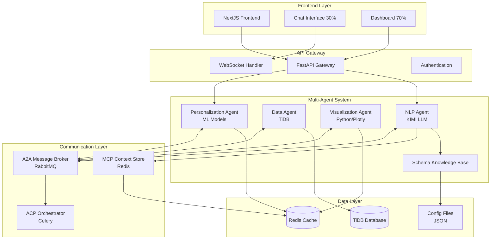
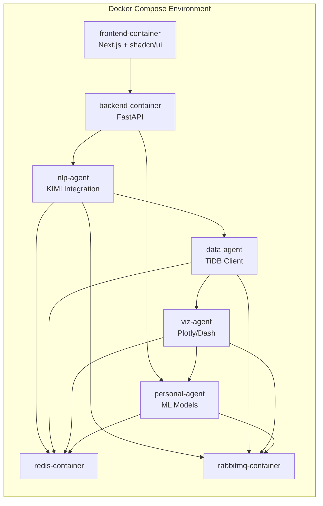

# Design Document

## Overview

The AI-Powered BI Agent for CFOs is a sophisticated multi-agent system that provides natural language querying capabilities with dynamic dashboard visualization. The system leverages KIMI LLM for natural language processing, TiDB for financial data storage, and implements a microservices architecture with standardized communication protocols (MCP, A2A, ACP).

The core design philosophy centers around intelligent personalization, semantic query understanding, and real-time financial data visualization tailored specifically for CFO workflows and decision-making processes.

## Architecture

### High-Level System Architecture



### Container Architecture



## Components and Interfaces

### 1. Frontend Components

#### Chat Interface Component

- **Technology**: Next.js with TypeScript, Socket.io client, shadcn/ui components
- **Responsibilities**:
  - Natural language input handling with auto-complete using shadcn/ui Input and Command components
  - Real-time message streaming from backend
  - Query history management with search functionality using shadcn/ui ScrollArea
  - Personalized suggestion display based on user patterns using shadcn/ui Badge and Button components
  - Feedback collection (thumbs up/down) for learning using shadcn/ui Button variants
- **Key Interfaces**:
  - `ChatMessage`: Message structure with metadata
  - `QuerySuggestion`: Personalized query recommendations
  - `UserFeedback`: Rating and preference data
- **shadcn/ui Components Used**:
  - Input, Textarea for query input
  - Button for actions and feedback
  - Card for message containers
  - Badge for query suggestions
  - ScrollArea for chat history

#### Dashboard Visualization Component

- **Technology**: Next.js with Plotly.js, D3.js for custom charts, CSS Grid for Bento layout, shadcn/ui components
- **Responsibilities**:
  - Dynamic chart rendering based on query results
  - Bento grid layout management with varying card sizes using shadcn/ui Card components
  - Interactive chart controls (zoom, filter, drill-down) using shadcn/ui Button and DropdownMenu
  - Drag-and-drop card rearrangement functionality
  - Personalized layout management and theme application
  - Export functionality (PNG, PDF, CSV) using shadcn/ui Dialog and Button components
  - Real-time data updates via WebSocket
- **Key Interfaces**:
  - `ChartConfig`: Chart type, styling, and interaction settings
  - `BentoGridLayout`: Grid configuration with card sizes and positions
  - `DashboardCard`: Individual card component with content and styling
  - `DragDropConfig`: Drag-and-drop behavior and constraints
  - `ExportOptions`: Export format and customization options
- **shadcn/ui Components Used**:
  - Card, CardHeader, CardContent for dashboard cards
  - Button for interactive controls
  - DropdownMenu for chart options
  - Dialog for export functionality
  - Badge for KPI indicators
  - Separator for visual organization

#### Bento Grid UI/UX Design System

- **Technology**: CSS Grid, @dnd-kit/core for drag-and-drop, Framer Motion for animations, shadcn/ui design system
- **Design Principles**:
  - **Asymmetric Layout**: Cards of varying sizes (1x1, 2x1, 1x2, 2x2) for visual hierarchy
  - **Content-Driven Sizing**: KPI cards (1x1), charts (2x1 or 2x2), tables (2x2 or larger)
  - **shadcn/ui Consistency**: Using shadcn/ui spacing tokens (space-4 gaps, p-6 padding)
  - **Design System Integration**: shadcn/ui card styling with consistent shadows and borders
- **Card Types with shadcn/ui Components**:
  - **KPI Cards**: Small 1x1 cards using Card + Badge components for metrics
  - **Chart Cards**: Medium to large cards using Card + custom chart integration
  - **Table Cards**: Large cards using Card + Table components for detailed data
  - **Insight Cards**: Medium cards using Card + Alert components for AI insights
- **Responsive Behavior**:
  - Desktop: 6-column grid with full Bento layout
  - Tablet: 4-column grid with adapted card sizes
  - Mobile: 2-column grid with stacked layout using shadcn/ui responsive utilities
- **shadcn/ui Integration**:
  - Consistent theming with CSS variables
  - Dark/light mode support
  - Accessible components with proper ARIA labels
  - Consistent typography scale and color palette

### 2. Backend API Gateway

#### FastAPI Application

- **Technology**: FastAPI with async/await, Pydantic models
- **Responsibilities**:
  - Request routing and validation
  - WebSocket connection management for real-time updates
  - Authentication and session management
  - Rate limiting and security middleware
  - Agent orchestration and response aggregation
- **Key Endpoints**:
  - `POST /api/query`: Process natural language queries
  - `GET /api/suggestions`: Get personalized query suggestions
  - `WebSocket /ws/chat`: Real-time chat communication
  - `GET /api/dashboard/{query_id}`: Retrieve dashboard data
  - `POST /api/feedback`: Submit user feedback for learning

### 3. Multi-Agent System

#### NLP Agent (KIMI Integration)

- **Technology**: Python with KIMI API client, spaCy for preprocessing
- **Responsibilities**:
  - Natural language query parsing and intent extraction
  - Financial terminology recognition and normalization
  - Query context building for other agents
  - Ambiguity detection and clarification generation
- **Key Interfaces**:
  - `QueryIntent`: Structured representation of user intent
  - `FinancialEntity`: Recognized financial terms and metrics
  - `QueryContext`: Contextual information for processing
- **KIMI Integration**:
  - API endpoint configuration with retry logic
  - Prompt engineering for CFO-specific financial queries
  - Response parsing and validation
  - Context window management for complex queries

#### Data Agent (TiDB Integration)

- **Technology**: Python with TiDB connector, SQLAlchemy ORM
- **Responsibilities**:
  - SQL query generation from structured intents
  - Database connection pooling and optimization
  - Data validation and quality checks
  - Query performance monitoring and caching
- **Key Interfaces**:
  - `SQLQuery`: Generated SQL with parameters
  - `QueryResult`: Structured data results with metadata
  - `DataValidation`: Data quality and consistency checks
- **TiDB Integration**:
  - Connection string configuration with SSL
  - Query optimization for analytical workloads
  - Transaction management for data consistency
  - Error handling for connection failures

#### Visualization Agent

- **Technology**: Python with Plotly, Matplotlib, Pandas
- **Responsibilities**:
  - Chart type selection based on data characteristics
  - Dynamic visualization generation with CFO styling
  - Interactive element configuration
  - Performance optimization for large datasets
- **Key Interfaces**:
  - `ChartSpecification`: Chart configuration and styling
  - `VisualizationData`: Processed data ready for charting
  - `InteractiveConfig`: User interaction settings

#### Personalization Agent

- **Technology**: Python with scikit-learn, TensorFlow Lite
- **Responsibilities**:
  - User behavior pattern analysis and learning
  - Preference prediction and recommendation generation
  - Personalized dashboard layout optimization
  - Query success pattern recognition
- **Key Interfaces**:
  - `UserProfile`: Comprehensive user preference model
  - `PersonalizationRecommendation`: Suggested customizations
  - `LearningFeedback`: Training data from user interactions
- **Machine Learning Models**:
  - Collaborative filtering for query suggestions
  - Classification models for chart type preferences
  - Clustering for user behavior segmentation
  - Time series analysis for usage pattern prediction

#### Schema Knowledge Base

- **Technology**: JSON configuration files with Python processing engine
- **Responsibilities**:
  - Business term to database schema mapping
  - Query template management and selection
  - Semantic similarity matching for unknown terms
  - Dynamic query generation with parameter substitution
- **Configuration Structure**:
  - `business_terms.json`: CFO terminology mappings
  - `query_templates.json`: SQL template library
  - `metrics_config.json`: Financial calculation definitions
  - `patterns_config.json`: User behavior patterns

### 4. Communication Protocols

#### MCP (Model Context Protocol)

- **Implementation**: Redis-based context store with JSON serialization
- **Responsibilities**:
  - Cross-agent context sharing and persistence
  - Session state management across requests
  - Context versioning for rollback capabilities
- **Key Features**:
  - Context expiration and cleanup policies
  - Conflict resolution for concurrent updates
  - Context compression for large datasets

#### A2A (Agent-to-Agent Protocol)

- **Implementation**: RabbitMQ message broker with topic exchanges
- **Responsibilities**:
  - Direct peer-to-peer agent communication
  - Asynchronous task delegation and result collection
  - Load balancing across agent instances
- **Message Types**:
  - `QueryProcessingRequest`: NLP to Data Agent
  - `VisualizationRequest`: Data to Visualization Agent
  - `PersonalizationUpdate`: Feedback to Personalization Agent

#### ACP (Agent Communication Protocol)

- **Implementation**: Celery task queue with Redis backend
- **Responsibilities**:
  - High-level workflow orchestration
  - Error handling and retry mechanisms
  - Performance monitoring and logging
- **Workflow Patterns**:
  - Sequential processing for dependent tasks
  - Parallel processing for independent operations
  - Circuit breaker pattern for fault tolerance

## Data Models

### Database Schema (TiDB)

#### Financial Data Tables

```sql
-- Company Financial Overview
CREATE TABLE financial_overview (
    id BIGINT PRIMARY KEY AUTO_INCREMENT,
    period_date DATE NOT NULL,
    period_type ENUM('daily', 'monthly', quarterly', 'yearly') NOT NULL,
    revenue DECIMAL(15,2),
    gross_profit DECIMAL(15,2),
    net_profit DECIMAL(15,2),
    operating_expenses DECIMAL(15,2),
    created_at TIMESTAMP DEFAULT CURRENT_TIMESTAMP,
    updated_at TIMESTAMP DEFAULT CURRENT_TIMESTAMP ON UPDATE CURRENT_TIMESTAMP,
    INDEX idx_period_date (period_date),
    INDEX idx_period_type (period_type)
);

-- Cash Flow Data
CREATE TABLE cash_flow (
    id BIGINT PRIMARY KEY AUTO_INCREMENT,
    period_date DATE NOT NULL,
    operating_cash_flow DECIMAL(15,2),
    investing_cash_flow DECIMAL(15,2),
    financing_cash_flow DECIMAL(15,2),
    net_cash_flow DECIMAL(15,2),
    cash_balance DECIMAL(15,2),
    created_at TIMESTAMP DEFAULT CURRENT_TIMESTAMP,
    INDEX idx_period_date (period_date)
);

-- Budget Tracking
CREATE TABLE budget_tracking (
    id BIGINT PRIMARY KEY AUTO_INCREMENT,
    department VARCHAR(100) NOT NULL,
    period_date DATE NOT NULL,
    budgeted_amount DECIMAL(15,2),
    actual_amount DECIMAL(15,2),
    variance_amount DECIMAL(15,2),
    variance_percentage DECIMAL(5,2),
    created_at TIMESTAMP DEFAULT CURRENT_TIMESTAMP,
    INDEX idx_department_period (department, period_date)
);

-- Investment Performance
CREATE TABLE investments (
    id BIGINT PRIMARY KEY AUTO_INCREMENT,
    investment_name VARCHAR(200) NOT NULL,
    investment_category VARCHAR(100),
    initial_amount DECIMAL(15,2),
    current_value DECIMAL(15,2),
    roi_percentage DECIMAL(5,2),
    status ENUM('active', 'completed', 'terminated'),
    start_date DATE,
    end_date DATE,
    created_at TIMESTAMP DEFAULT CURRENT_TIMESTAMP,
    INDEX idx_status (status),
    INDEX idx_category (investment_category)
);

-- Financial Ratios
CREATE TABLE financial_ratios (
    id BIGINT PRIMARY KEY AUTO_INCREMENT,
    period_date DATE NOT NULL,
    debt_to_equity DECIMAL(5,2),
    current_ratio DECIMAL(5,2),
    quick_ratio DECIMAL(5,2),
    gross_margin DECIMAL(5,2),
    net_margin DECIMAL(5,2),
    created_at TIMESTAMP DEFAULT CURRENT_TIMESTAMP,
    INDEX idx_period_date (period_date)
);
```

#### User Personalization Tables

```sql
-- User Preferences
CREATE TABLE user_preferences (
    id BIGINT PRIMARY KEY AUTO_INCREMENT,
    user_id VARCHAR(100) NOT NULL,
    preference_type VARCHAR(50) NOT NULL,
    preference_value JSON,
    created_at TIMESTAMP DEFAULT CURRENT_TIMESTAMP,
    updated_at TIMESTAMP DEFAULT CURRENT_TIMESTAMP ON UPDATE CURRENT_TIMESTAMP,
    UNIQUE KEY uk_user_type (user_id, preference_type)
);

-- Query History
CREATE TABLE query_history (
    id BIGINT PRIMARY KEY AUTO_INCREMENT,
    user_id VARCHAR(100) NOT NULL,
    query_text TEXT NOT NULL,
    query_intent JSON,
    response_data JSON,
    satisfaction_rating TINYINT,
    processing_time_ms INT,
    created_at TIMESTAMP DEFAULT CURRENT_TIMESTAMP,
    INDEX idx_user_id (user_id),
    INDEX idx_created_at (created_at)
);

-- User Behavior Analytics
CREATE TABLE user_behavior (
    id BIGINT PRIMARY KEY AUTO_INCREMENT,
    user_id VARCHAR(100) NOT NULL,
    session_id VARCHAR(100),
    action_type VARCHAR(50),
    action_data JSON,
    timestamp TIMESTAMP DEFAULT CURRENT_TIMESTAMP,
    INDEX idx_user_session (user_id, session_id),
    INDEX idx_timestamp (timestamp)
);
```

### Application Data Models

#### Core Query Processing Models

```python
from pydantic import BaseModel, Field
from typing import List, Dict, Any, Optional
from datetime import datetime
from enum import Enum

class QueryIntent(BaseModel):
    """Structured representation of user query intent"""
    metric_type: str = Field(..., description="Type of financial metric requested")
    time_period: str = Field(..., description="Time period for the query")
    aggregation_level: str = Field(default="monthly", description="Data aggregation level")
    filters: Dict[str, Any] = Field(default_factory=dict, description="Additional filters")
    comparison_periods: List[str] = Field(default_factory=list, description="Periods for comparison")
    visualization_hint: Optional[str] = Field(None, description="Suggested visualization type")

class FinancialEntity(BaseModel):
    """Recognized financial terms and metrics"""
    entity_type: str = Field(..., description="Type of financial entity")
    entity_value: str = Field(..., description="Normalized entity value")
    confidence_score: float = Field(..., description="Recognition confidence")
    synonyms: List[str] = Field(default_factory=list, description="Alternative terms")

class QueryResult(BaseModel):
    """Structured data results with metadata"""
    data: List[Dict[str, Any]] = Field(..., description="Query result data")
    columns: List[str] = Field(..., description="Column names")
    row_count: int = Field(..., description="Number of rows returned")
    query_metadata: Dict[str, Any] = Field(default_factory=dict, description="Query execution metadata")
    processing_time_ms: int = Field(..., description="Query processing time")
```

#### Personalization Models

```python
class UserProfile(BaseModel):
    """Comprehensive user preference model"""
    user_id: str = Field(..., description="Unique user identifier")
    chart_preferences: Dict[str, str] = Field(default_factory=dict, description="Preferred chart types by metric")
    color_scheme: str = Field(default="corporate", description="Preferred color scheme")
    dashboard_layout: Dict[str, Any] = Field(default_factory=dict, description="Dashboard layout preferences")
    query_patterns: List[str] = Field(default_factory=list, description="Common query patterns")
    expertise_level: str = Field(default="intermediate", description="User expertise level")
    last_updated: datetime = Field(default_factory=datetime.now, description="Last profile update")

class PersonalizationRecommendation(BaseModel):
    """Suggested customizations based on user behavior"""
    recommendation_type: str = Field(..., description="Type of recommendation")
    suggestion: str = Field(..., description="Recommended action or setting")
    confidence_score: float = Field(..., description="Confidence in recommendation")
    reasoning: str = Field(..., description="Explanation for recommendation")
```

#### Bento Grid UI Models

```python
from enum import Enum

class CardSize(str, Enum):
    """Bento grid card size options"""
    SMALL = "1x1"      # KPI cards
    MEDIUM_H = "2x1"   # Horizontal charts, insights
    MEDIUM_V = "1x2"   # Vertical charts
    LARGE = "2x2"      # Complex charts, tables
    EXTRA_LARGE = "3x2" # Large tables, dashboards

class CardType(str, Enum):
    """Types of dashboard cards"""
    KPI = "kpi"
    CHART = "chart"
    TABLE = "table"
    INSIGHT = "insight"
    CUSTOM = "custom"

class BentoGridCard(BaseModel):
    """Individual card in the Bento grid"""
    id: str = Field(..., description="Unique card identifier")
    card_type: CardType = Field(..., description="Type of card content")
    size: CardSize = Field(..., description="Card size in grid units")
    position: Dict[str, int] = Field(..., description="Grid position (row, col)")
    content: Dict[str, Any] = Field(..., description="Card content data")
    styling: Dict[str, Any] = Field(default_factory=dict, description="Custom styling options")
    is_draggable: bool = Field(default=True, description="Whether card can be moved")
    is_resizable: bool = Field(default=False, description="Whether card can be resized")

class BentoGridLayout(BaseModel):
    """Complete Bento grid layout configuration"""
    layout_id: str = Field(..., description="Unique layout identifier")
    user_id: str = Field(..., description="User who owns this layout")
    grid_columns: int = Field(default=6, description="Number of grid columns")
    cards: List[BentoGridCard] = Field(..., description="Cards in the layout")
    layout_name: str = Field(default="Default", description="User-friendly layout name")
    is_default: bool = Field(default=False, description="Whether this is the default layout")
    created_at: datetime = Field(default_factory=datetime.now, description="Layout creation time")
    updated_at: datetime = Field(default_factory=datetime.now, description="Last layout update")

class DragDropConfig(BaseModel):
    """Configuration for drag-and-drop behavior"""
    enable_drag: bool = Field(default=True, description="Enable card dragging")
    enable_resize: bool = Field(default=False, description="Enable card resizing")
    snap_to_grid: bool = Field(default=True, description="Snap cards to grid positions")
    collision_detection: bool = Field(default=True, description="Prevent card overlaps")
    animation_duration: int = Field(default=300, description="Animation duration in ms")
```

## Error Handling

### Error Classification and Response Strategy

#### 1. Query Understanding Errors

- **Unknown Financial Terms**: Implement fuzzy matching with similarity threshold of 0.7
- **Ambiguous Queries**: Provide ranked clarification options with context
- **Incomplete Queries**: Proactive suggestion of missing parameters
- **Response Pattern**: Educational guidance with examples

#### 2. Data Access Errors

- **Database Connection Failures**: Automatic retry with exponential backoff
- **Query Timeout**: Optimize query or suggest data range reduction
- **Data Quality Issues**: Validation warnings with data source information
- **Response Pattern**: Graceful degradation with alternative data sources

#### 3. Agent Communication Errors

- **Agent Unavailability**: Circuit breaker pattern with fallback responses
- **Message Queue Failures**: Dead letter queue with manual intervention alerts
- **Context Loss**: Context reconstruction from persistent storage
- **Response Pattern**: Transparent error communication with retry options

#### 4. Personalization Errors

- **Model Prediction Failures**: Fallback to default preferences
- **Preference Conflicts**: User-guided conflict resolution
- **Learning Data Corruption**: Model rollback to previous version
- **Response Pattern**: Maintain functionality with reduced personalization

### Error Recovery Mechanisms

```python
class ErrorHandler:
    """Centralized error handling with recovery strategies"""

    async def handle_query_error(self, error: Exception, context: QueryContext) -> ErrorResponse:
        """Handle query processing errors with appropriate recovery"""
        if isinstance(error, UnknownTermError):
            suggestions = await self.find_similar_terms(error.term)
            return ErrorResponse(
                error_type="unknown_term",
                message=f"I don't recognize '{error.term}'. Did you mean:",
                suggestions=suggestions,
                recovery_action="clarification"
            )
        elif isinstance(error, DatabaseError):
            return await self.handle_database_error(error, context)
        # Additional error handling patterns...

    async def handle_database_error(self, error: DatabaseError, context: QueryContext) -> ErrorResponse:
        """Handle database-related errors with fallback strategies"""
        if error.is_timeout():
            return ErrorResponse(
                error_type="query_timeout",
                message="Query is taking longer than expected. Try a smaller date range?",
                suggestions=["Last 3 months", "Current quarter", "This year"],
                recovery_action="query_modification"
            )
        # Additional database error handling...
```

## Testing Strategy

### 1. Unit Testing

#### Agent Testing

- **NLP Agent**: Query parsing accuracy, KIMI API integration, error handling
- **Data Agent**: SQL generation correctness, TiDB connection handling, query optimization
- **Visualization Agent**: Chart generation, styling application, export functionality
- **Personalization Agent**: Preference learning, recommendation accuracy, model performance

#### Component Testing

- **Schema Knowledge Base**: Term mapping accuracy, template selection, similarity matching
- **Communication Protocols**: Message routing, context persistence, error propagation
- **Frontend Components**: User interaction handling, real-time updates, responsive design

### 2. Integration Testing

#### End-to-End Query Processing

- **Test Scenarios**:
  - Simple financial metric queries ("Show me quarterly revenue")
  - Complex comparative queries ("Compare cash flow this year vs last year")
  - Personalized query suggestions based on user history
  - Error handling for unknown terms and ambiguous queries

#### Agent Communication Testing

- **Protocol Testing**: MCP context sharing, A2A message passing, ACP workflow orchestration
- **Failure Scenarios**: Agent unavailability, message queue failures, context corruption
- **Performance Testing**: Concurrent user handling, response time optimization

### 3. User Acceptance Testing

#### CFO-Specific Scenarios

- **Financial Analysis Workflows**: Budget variance analysis, cash flow monitoring, ROI tracking
- **Dashboard Customization**: Personalized layouts, chart preferences, export functionality
- **Learning Effectiveness**: Preference adaptation, suggestion accuracy improvement
- **Error Recovery**: User guidance for failed queries, alternative suggestion usefulness

#### Performance Benchmarks

- **Response Time**: < 10 seconds for 95% of queries
- **Accuracy**: > 90% correct data retrieval and visualization
- **Personalization**: 75% improvement in user satisfaction with personalized features
- **Concurrent Users**: Support for 10+ simultaneous users

### 4. Load and Performance Testing

#### System Scalability

- **Database Performance**: Query optimization for large datasets, connection pooling efficiency
- **Agent Scalability**: Horizontal scaling of agent workers, load balancing effectiveness
- **Frontend Performance**: Chart rendering optimization, real-time update handling
- **Memory Management**: Context store optimization, cache efficiency

#### Stress Testing Scenarios

- **High Query Volume**: 100+ concurrent queries with response time monitoring
- **Large Dataset Handling**: Multi-year financial data with complex aggregations
- **Personalization Load**: Multiple users with extensive preference learning
- **Error Cascade Testing**: System behavior under multiple simultaneous failures

This comprehensive design provides a solid foundation for implementing the AI-Powered BI Agent system with all the specified requirements including KIMI LLM integration, TiDB database connectivity, multi-agent architecture, and advanced personalization capabilities.
