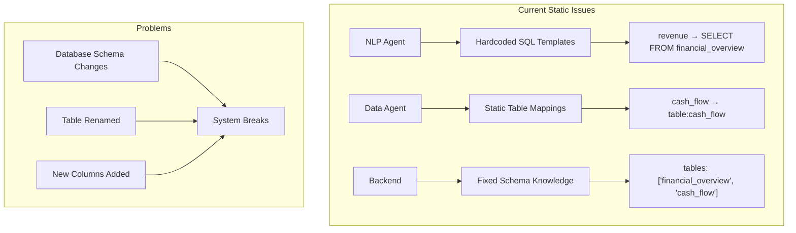
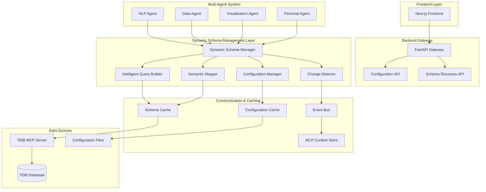
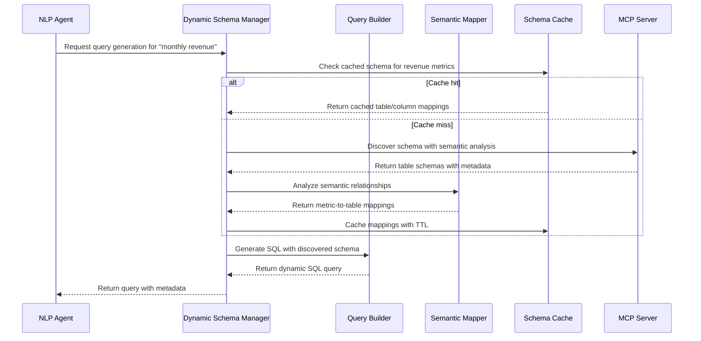

# Dynamic Schema Management Design Document

## Overview

This design document outlines the architecture for implementing dynamic schema management in the AI CFO BI Agent system. The solution addresses the current static configuration issues by implementing intelligent schema discovery, flexible query generation, and runtime configuration management. The design leverages the existing TiDB MCP server while adding new components for semantic understanding, configuration management, and agent synchronization.

## Architecture

### Current Architecture (Static Configuration Problems)



### Target Architecture (Dynamic Schema Management)



### Component Integration Flow



## Components and Interfaces

### 1. Dynamic Schema Manager (Core Component)

**Purpose**: Central orchestrator for all schema-related operations across agents.

**Key Responsibilities**:

- Coordinate schema discovery across all agents
- Manage schema caching and invalidation
- Provide unified schema interface to agents
- Handle schema change notifications

**Interface**:

```python
class DynamicSchemaManager:
    async def discover_schema(self, force_refresh: bool = False) -> SchemaInfo
    async def find_tables_for_metric(self, metric_type: str) -> List[TableMapping]
    async def get_column_mappings(self, business_term: str) -> List[ColumnMapping]
    async def generate_query_context(self, intent: QueryIntent) -> QueryContext
    async def invalidate_schema_cache(self, scope: str = "all") -> None
    async def register_schema_change_listener(self, callback: Callable) -> None
```

### 2. Intelligent Query Builder

**Purpose**: Generate SQL queries dynamically using discovered schema information.

**Key Responsibilities**:

- Replace static SQL templates with dynamic generation
- Map business terms to actual database objects
- Handle schema variations and alternatives
- Optimize queries based on discovered indexes

**Interface**:

```python
class IntelligentQueryBuilder:
    async def build_query(self, intent: QueryIntent, schema_context: SchemaContext) -> QueryResult
    async def suggest_alternatives(self, failed_query: str, error: str) -> List[QuerySuggestion]
    async def optimize_query(self, base_query: str, schema_info: SchemaInfo) -> OptimizedQuery
    async def validate_query_against_schema(self, query: str) -> ValidationResult
```

### 3. Semantic Schema Mapper

**Purpose**: Understand and map business terminology to database schema elements.

**Key Responsibilities**:

- Analyze table and column names for semantic meaning
- Create mappings between business terms and database objects
- Rank mapping confidence and alternatives
- Learn from successful mappings over time

**Interface**:

```python
class SemanticSchemaMapper:
    async def analyze_schema_semantics(self, schema: SchemaInfo) -> SemanticMapping
    async def map_business_term(self, term: str, context: str = None) -> List[SchemaMapping]
    async def find_similar_terms(self, term: str, threshold: float = 0.7) -> List[SimilarTerm]
    async def learn_from_successful_mapping(self, term: str, mapping: SchemaMapping) -> None
    async def get_mapping_confidence(self, term: str, mapping: SchemaMapping) -> float
```

### 4. Configuration Manager

**Purpose**: Manage runtime configuration and business rule updates.

**Key Responsibilities**:

- Load and validate configuration from multiple sources
- Provide runtime configuration updates
- Manage environment-specific settings
- Handle configuration validation and rollback

**Interface**:

```python
class ConfigurationManager:
    async def load_configuration(self, config_sources: List[str]) -> Configuration
    async def update_configuration(self, updates: Dict[str, Any]) -> UpdateResult
    async def get_configuration(self, key: str, default: Any = None) -> Any
    async def validate_configuration(self, config: Dict[str, Any]) -> ValidationResult
    async def rollback_configuration(self, checkpoint: str) -> bool
    async def create_checkpoint(self, name: str) -> str
```

### 5. Schema Change Detector

**Purpose**: Monitor database schema changes and trigger appropriate responses.

**Key Responsibilities**:

- Detect schema modifications in real-time
- Classify change severity and impact
- Trigger cache invalidation and agent notifications
- Generate migration recommendations

**Interface**:

```python
class SchemaChangeDetector:
    async def start_monitoring(self) -> None
    async def detect_changes(self) -> List[SchemaChange]
    async def classify_change_impact(self, change: SchemaChange) -> ChangeImpact
    async def notify_agents(self, changes: List[SchemaChange]) -> None
    async def generate_migration_recommendations(self, changes: List[SchemaChange]) -> List[MigrationStep]
```

### 6. Enhanced Schema Cache

**Purpose**: Intelligent caching system with semantic understanding and change detection.

**Key Responsibilities**:

- Cache schema information with semantic metadata
- Implement smart TTL based on change frequency
- Provide cache warming and prefetching
- Handle distributed cache consistency

**Interface**:

```python
class EnhancedSchemaCache:
    async def get_schema(self, key: str, semantic_context: str = None) -> Optional[CachedSchema]
    async def set_schema(self, key: str, schema: SchemaInfo, ttl: int = None) -> None
    async def invalidate_by_pattern(self, pattern: str) -> int
    async def warm_cache(self, priorities: List[str]) -> None
    async def get_cache_statistics(self) -> CacheStatistics
```

## Data Models

### Enhanced Schema Models

```python
@dataclass
class SchemaInfo:
    """Complete schema information with semantic metadata"""
    database: str
    tables: List[EnhancedTableInfo]
    relationships: List[TableRelationship]
    semantic_metadata: Dict[str, Any]
    discovery_timestamp: datetime
    confidence_score: float

@dataclass
class EnhancedTableInfo:
    """Table information with business context"""
    name: str
    display_name: str
    description: str
    columns: List[EnhancedColumnInfo]
    business_purpose: str
    data_freshness: str
    semantic_tags: List[str]
    confidence_score: float

@dataclass
class EnhancedColumnInfo:
    """Column information with semantic understanding"""
    name: str
    display_name: str
    data_type: str
    business_meaning: str
    semantic_type: str  # 'metric', 'dimension', 'date', 'identifier'
    example_values: List[str]
    value_patterns: List[str]
    confidence_score: float

@dataclass
class SemanticMapping:
    """Mapping between business terms and schema elements"""
    business_term: str
    schema_path: str  # database.table.column
    mapping_type: str  # 'exact', 'similar', 'derived'
    confidence_score: float
    alternative_mappings: List['SemanticMapping']
    validation_rules: List[str]

@dataclass
class QueryContext:
    """Dynamic query context with discovered schema"""
    intent: QueryIntent
    table_mappings: List[TableMapping]
    column_mappings: List[ColumnMapping]
    suggested_joins: List[JoinSuggestion]
    optimization_hints: List[OptimizationHint]
    alternative_approaches: List[AlternativeApproach]
```

### Configuration Models

```python
@dataclass
class DynamicConfiguration:
    """Runtime configuration for dynamic schema management"""
    schema_discovery: SchemaDiscoveryConfig
    semantic_mapping: SemanticMappingConfig
    cache_management: CacheManagementConfig
    change_detection: ChangeDetectionConfig
    query_generation: QueryGenerationConfig

@dataclass
class SchemaDiscoveryConfig:
    """Configuration for schema discovery operations"""
    discovery_interval: int = 300  # 5 minutes
    cache_ttl: int = 300
    semantic_analysis_enabled: bool = True
    confidence_threshold: float = 0.7
    max_discovery_time: int = 30  # seconds

@dataclass
class SemanticMappingConfig:
    """Configuration for semantic mapping operations"""
    similarity_threshold: float = 0.7
    learning_enabled: bool = True
    confidence_boost_factor: float = 0.1
    alternative_suggestions: int = 3
    semantic_model_path: str = "models/semantic_model.pkl"
```

### Change Detection Models

```python
@dataclass
class SchemaChange:
    """Detected schema change information"""
    change_type: str  # 'table_added', 'column_added', 'column_renamed', etc.
    affected_object: str
    change_details: Dict[str, Any]
    impact_level: str  # 'low', 'medium', 'high', 'breaking'
    detected_at: datetime
    affected_mappings: List[str]

@dataclass
class ChangeImpact:
    """Impact analysis of schema changes"""
    severity: str
    affected_agents: List[str]
    affected_queries: List[str]
    migration_required: bool
    recommended_actions: List[str]
    estimated_downtime: int
```

## Implementation Strategy

### Phase 1: Foundation Layer

1. **Dynamic Schema Manager Implementation**

   - Create core DSM class with MCP integration
   - Implement basic schema discovery and caching
   - Add configuration management foundation

2. **Enhanced MCP Client**

   - Extend existing MCP client with semantic analysis
   - Add schema discovery optimizations
   - Implement connection pooling and retry logic

3. **Configuration Framework**
   - Create configuration management system
   - Implement environment-specific configurations
   - Add validation and hot-reload capabilities

### Phase 2: Intelligent Query Generation

1. **Semantic Schema Mapper**

   - Implement semantic analysis of table/column names
   - Create business term to schema mapping
   - Add similarity matching algorithms

2. **Intelligent Query Builder**

   - Replace static SQL templates with dynamic generation
   - Implement query optimization based on discovered schema
   - Add alternative query suggestion capabilities

3. **Schema Change Detection**
   - Implement change monitoring using database triggers
   - Add impact analysis and notification system
   - Create migration recommendation engine

### Phase 3: Agent Integration

1. **NLP Agent Enhancement**

   - Replace static query generation with dynamic builder
   - Integrate semantic mapping for business terms
   - Add query validation against discovered schema

2. **Data Agent Enhancement**

   - Replace static table mappings with dynamic discovery
   - Implement flexible caching strategies
   - Add schema-aware data validation

3. **Cross-Agent Synchronization**
   - Implement event-driven schema updates
   - Add distributed cache consistency
   - Create agent health monitoring

### Phase 4: Advanced Features

1. **Machine Learning Integration**

   - Implement semantic similarity models
   - Add query success pattern learning
   - Create predictive schema change detection

2. **Performance Optimization**

   - Implement intelligent cache warming
   - Add query performance monitoring
   - Create adaptive TTL strategies

3. **Monitoring and Observability**
   - Add comprehensive metrics collection
   - Implement alerting for schema changes
   - Create performance dashboards

## Error Handling and Fallback Strategies

### Error Categories

1. **Schema Discovery Failures**

   - MCP server unavailable
   - Database connectivity issues
   - Permission problems

2. **Semantic Mapping Failures**

   - Unknown business terms
   - Ambiguous mappings
   - Low confidence scores

3. **Query Generation Failures**

   - Schema incompatibilities
   - Missing required tables/columns
   - Complex semantic requirements

4. **Configuration Errors**
   - Invalid configuration updates
   - Version conflicts
   - Validation failures

### Fallback Mechanisms

```python
class FallbackManager:
    """Manages fallback strategies for dynamic schema management"""

    async def handle_schema_discovery_failure(self, error: Exception) -> SchemaInfo:
        """Fallback strategy for schema discovery failures"""
        # 1. Try cached schema if available
        if cached_schema := await self.cache.get_cached_schema():
            logger.warning("Using cached schema due to discovery failure")
            return cached_schema

        # 2. Use minimal default schema
        if self.config.enable_minimal_fallback:
            return await self.create_minimal_schema()

        # 3. Raise error if no fallback available
        raise SchemaDiscoveryError("No fallback schema available") from error

    async def handle_mapping_failure(self, term: str, error: Exception) -> List[SemanticMapping]:
        """Fallback strategy for semantic mapping failures"""
        # 1. Try fuzzy matching with lower threshold
        if fuzzy_matches := await self.find_fuzzy_matches(term, threshold=0.5):
            return fuzzy_matches

        # 2. Use static fallback mappings if configured
        if static_mapping := self.config.static_fallback_mappings.get(term):
            return [static_mapping]

        # 3. Return empty list to let higher-level error handling take over
        return []
```

## Testing Strategy

### Unit Testing

```python
# Test structure for dynamic schema management
tests/
├── unit/
│   ├── test_dynamic_schema_manager.py
│   ├── test_intelligent_query_builder.py
│   ├── test_semantic_mapper.py
│   ├── test_configuration_manager.py
│   ├── test_change_detector.py
│   └── test_fallback_strategies.py
├── integration/
│   ├── test_agent_integration.py
│   ├── test_mcp_integration.py
│   ├── test_cache_consistency.py
│   └── test_end_to_end_workflows.py
├── performance/
│   ├── test_schema_discovery_performance.py
│   ├── test_query_generation_performance.py
│   └── test_cache_performance.py
└── fixtures/
    ├── sample_schemas/
    ├── test_configurations/
    └── mock_databases/
```

### Integration Testing Scenarios

1. **Schema Discovery Integration**

   - Test with various database schemas
   - Validate semantic analysis accuracy
   - Test cache consistency across agents

2. **Query Generation Integration**

   - Test dynamic query generation with real schemas
   - Validate query correctness and performance
   - Test fallback mechanisms

3. **Change Detection Integration**
   - Test schema change detection accuracy
   - Validate impact analysis correctness
   - Test agent notification system

### Performance Benchmarks

```python
class PerformanceBenchmarks:
    """Performance targets for dynamic schema management"""

    SCHEMA_DISCOVERY_MAX_TIME = 30  # seconds
    SEMANTIC_MAPPING_MAX_TIME = 5   # seconds
    QUERY_GENERATION_MAX_TIME = 10  # seconds
    CACHE_OPERATION_MAX_TIME = 1    # second

    SCHEMA_DISCOVERY_SUCCESS_RATE = 0.95
    SEMANTIC_MAPPING_ACCURACY = 0.85
    QUERY_GENERATION_SUCCESS_RATE = 0.90
```

## Security Considerations

### Access Control

1. **Schema Access Permissions**

   - Respect database-level permissions
   - Implement schema-level access controls
   - Audit all schema discovery operations

2. **Configuration Security**

   - Encrypt sensitive configuration values
   - Implement role-based configuration access
   - Audit configuration changes

3. **Cache Security**
   - Encrypt cached schema information
   - Implement cache access controls
   - Regular cache cleanup for sensitive data

### Data Privacy

1. **Schema Information Protection**

   - Mask sensitive table/column names
   - Exclude sensitive databases from discovery
   - Implement data classification awareness

2. **Query Security**
   - Validate generated queries for security risks
   - Implement query injection prevention
   - Audit all generated and executed queries

This comprehensive design provides a robust foundation for implementing dynamic schema management that will eliminate the static configuration issues while maintaining system performance and reliability.
