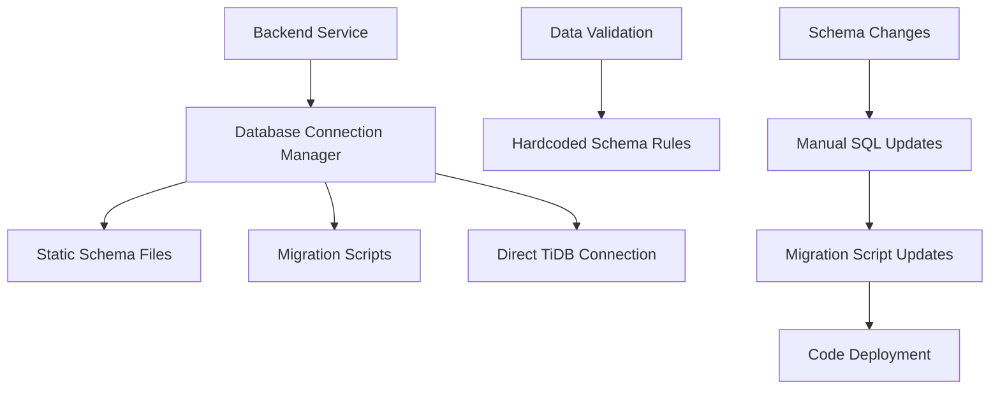
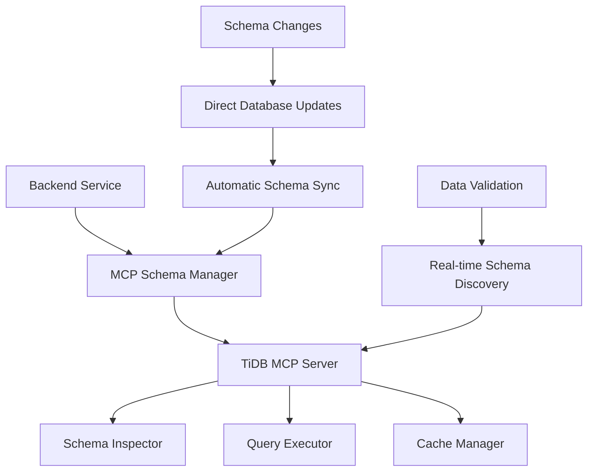

# Design Document

## Overview

This design outlines the migration from static schema management to dynamic MCP-based schema management for the AGENT BI. The system will leverage the existing TiDB MCP server to replace static SQL files, migration scripts, and hardcoded schema definitions with real-time schema discovery and operations through the Model Context Protocol (MCP).

The migration will maintain backward compatibility while providing enhanced flexibility, real-time schema synchronization, and reduced maintenance overhead. The existing TiDB MCP server already provides comprehensive database operations including schema discovery, query execution, and data sampling.

## Architecture

### Current Architecture (Static Schema)



### Target Architecture (MCP-Based Schema)



### Integration Points

1. **Backend Database Layer**: Replace direct database connections with MCP client calls
2. **Data Validation Layer**: Use real-time schema information for validation rules
3. **Migration System**: Replace static migrations with MCP-based schema operations
4. **Configuration Management**: Add MCP client configuration and connection management

## Components and Interfaces

### 1. MCP Schema Manager

**Purpose**: Central component that manages all schema-related operations through the MCP server.

**Key Responsibilities**:

- Schema discovery and caching
- Table structure retrieval
- Data type validation
- Connection management to MCP server

**Interface**:

```python
class MCPSchemaManager:
    async def discover_databases(self) -> List[DatabaseInfo]
    async def get_table_schema(self, database: str, table: str) -> TableSchema
    async def get_tables(self, database: str) -> List[TableInfo]
    async def validate_table_exists(self, database: str, table: str) -> bool
    async def get_column_info(self, database: str, table: str, column: str) -> ColumnInfo
    async def refresh_schema_cache(self, cache_type: str = "all") -> bool
```

### 2. Enhanced MCP Client

**Purpose**: Extend the existing backend MCP client with schema-specific operations.

**Key Responsibilities**:

- MCP server communication
- Error handling and retry logic
- Connection pooling and health monitoring
- Response caching and optimization

**Interface**:

```python
class EnhancedMCPClient(BackendMCPClient):
    async def discover_schema(self, database: str) -> SchemaDiscoveryResult
    async def get_table_schema_detailed(self, database: str, table: str) -> DetailedTableSchema
    async def validate_query_against_schema(self, query: str) -> QueryValidationResult
    async def get_constraint_info(self, database: str, table: str) -> ConstraintInfo
    async def check_schema_compatibility(self, expected_schema: Dict) -> CompatibilityResult
```

### 3. Dynamic Data Validator

**Purpose**: Replace static validation rules with dynamic schema-based validation.

**Key Responsibilities**:

- Real-time schema-based validation
- Dynamic constraint checking
- Type validation using current schema
- Relationship validation

**Interface**:

```python
class DynamicDataValidator:
    async def validate_against_schema(self, data: Dict, table: str) -> ValidationResult
    async def validate_data_types(self, data: Dict, schema: TableSchema) -> List[ValidationError]
    async def validate_constraints(self, data: Dict, constraints: ConstraintInfo) -> List[ValidationError]
    async def validate_relationships(self, data: Dict, foreign_keys: List[ForeignKey]) -> List[ValidationError]
```

### 4. Schema Cache Layer

**Purpose**: Provide efficient caching of schema information to minimize MCP server calls.

**Key Responsibilities**:

- Schema information caching
- Cache invalidation strategies
- Performance optimization
- Fallback mechanisms

**Interface**:

```python
class SchemaCacheLayer:
    async def get_cached_schema(self, cache_key: str) -> Optional[Any]
    async def set_schema_cache(self, cache_key: str, data: Any, ttl: int = 300) -> bool
    async def invalidate_schema_cache(self, pattern: str = "*") -> int
    async def get_cache_stats(self) -> CacheStats
```

## Data Models

### Schema Information Models

```python
@dataclass
class DatabaseInfo:
    name: str
    charset: str
    collation: str
    accessible: bool
    table_count: Optional[int] = None

@dataclass
class TableInfo:
    name: str
    type: str
    engine: str
    rows: int
    size_mb: float
    comment: Optional[str] = None

@dataclass
class ColumnInfo:
    name: str
    data_type: str
    is_nullable: bool
    default_value: Optional[str]
    is_primary_key: bool
    is_foreign_key: bool
    comment: Optional[str] = None
    max_length: Optional[int] = None
    precision: Optional[int] = None
    scale: Optional[int] = None

@dataclass
class TableSchema:
    database: str
    table: str
    columns: List[ColumnInfo]
    indexes: List[IndexInfo]
    primary_keys: List[str]
    foreign_keys: List[ForeignKeyInfo]
    constraints: List[ConstraintInfo]

@dataclass
class ValidationResult:
    is_valid: bool
    errors: List[ValidationError]
    warnings: List[ValidationWarning]
    validated_fields: List[str]
```

### Configuration Models

```python
@dataclass
class MCPSchemaConfig:
    mcp_server_url: str
    connection_timeout: int = 30
    request_timeout: int = 60
    max_retries: int = 3
    retry_delay: float = 1.0
    cache_ttl: int = 300
    enable_caching: bool = True
    fallback_enabled: bool = True

@dataclass
class SchemaValidationConfig:
    strict_mode: bool = False
    validate_types: bool = True
    validate_constraints: bool = True
    validate_relationships: bool = True
    allow_unknown_columns: bool = False
```

## Error Handling

### Error Categories

1. **Connection Errors**: MCP server unavailable, network issues
2. **Schema Errors**: Table not found, column not found, schema mismatch
3. **Validation Errors**: Data type mismatch, constraint violations
4. **Cache Errors**: Cache unavailable, cache corruption

### Error Handling Strategy

```python
class MCPSchemaError(Exception):
    """Base exception for MCP schema operations"""
    pass

class SchemaNotFoundError(MCPSchemaError):
    """Raised when requested schema element is not found"""
    pass

class SchemaValidationError(MCPSchemaError):
    """Raised when schema validation fails"""
    pass

class MCPConnectionError(MCPSchemaError):
    """Raised when MCP server connection fails"""
    pass

# Error handling with fallback mechanisms
async def with_fallback(primary_operation, fallback_operation=None):
    try:
        return await primary_operation()
    except MCPConnectionError:
        if fallback_operation:
            logger.warning("MCP server unavailable, using fallback")
            return await fallback_operation()
        raise
    except Exception as e:
        logger.error(f"Operation failed: {e}")
        raise
```

### Graceful Degradation

1. **Cache Fallback**: Use cached schema when MCP server is unavailable
2. **Basic Validation**: Fall back to basic type checking when schema is unavailable
3. **Static Schema Fallback**: Temporary fallback to static schema during migration
4. **Error Reporting**: Comprehensive error logging and monitoring

## Testing Strategy

### Unit Testing

1. **MCP Client Tests**: Mock MCP server responses, test error handling
2. **Schema Manager Tests**: Test schema discovery, caching, validation
3. **Data Validator Tests**: Test dynamic validation against various schemas
4. **Cache Layer Tests**: Test caching behavior, invalidation, performance

### Integration Testing

1. **MCP Server Integration**: Test against real MCP server instance
2. **Database Integration**: Test schema discovery with actual TiDB database
3. **End-to-End Testing**: Test complete workflow from request to validation
4. **Performance Testing**: Test response times, cache effectiveness

### Migration Testing

1. **Backward Compatibility**: Ensure existing APIs continue to work
2. **Data Integrity**: Verify data validation produces same results
3. **Performance Comparison**: Compare performance before and after migration
4. **Rollback Testing**: Test ability to rollback to static schema if needed
