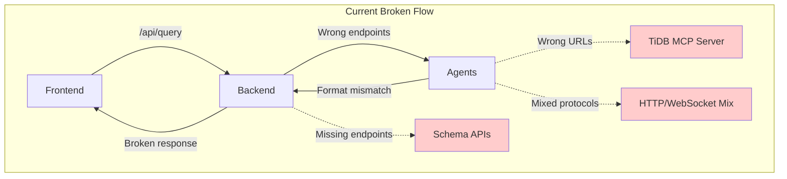
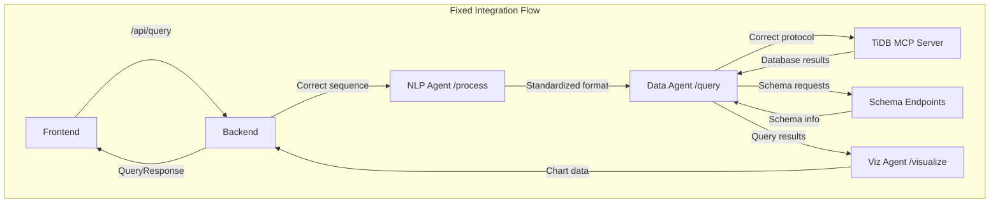

# Workflow Integration Fix Design Document

## Overview

This design document addresses the critical workflow inconsistencies identified across the multi-agent BI system. The current implementation has broken integration points between frontend, backend, agents, and TiDB MCP server that prevent the system from working as intended. This design provides a comprehensive fix to align all components and establish proper data flow.

## Problem Analysis

### Current Broken Workflow



### Target Fixed Workflow



## Architecture Design

### 1. API Layer Standardization

#### Current Issues

- Frontend calls `/api/query` but backend has different endpoint names
- Response formats don't match between components
- Missing schema management endpoints

#### Design Solution

```typescript
// Standardized API Interface
interface StandardizedAPI {
  // Query Processing
  "POST /api/query": {
    request: QueryRequest;
    response: QueryResponse;
  };

  // Schema Management
  "GET /api/schema/discovery": {
    response: DatabaseSchema[];
  };

  "GET /api/schema/mappings": {
    response: SchemaMapping[];
  };

  "GET /api/schema/relationships": {
    response: SchemaRelationship[];
  };

  // Database Context
  "POST /api/database/select": {
    request: DatabaseSelectionRequest;
    response: DatabaseContextResponse;
  };
}
```

### 2. Agent Communication Standardization

#### Current Issues

- Mixed HTTP/WebSocket protocols
- Wrong endpoint names
- Inconsistent data formats

#### Design Solution

```python
# Standardized Agent Interfaces
class AgentInterface:
    """Base interface for all agents"""

    @abstractmethod
    async def process(self, request: AgentRequest) -> AgentResponse:
        """Standard processing method for all agents"""
        pass

    @abstractmethod
    async def health_check(self) -> HealthStatus:
        """Standard health check method"""
        pass

# Specific Agent Implementations
class NLPAgentInterface(AgentInterface):
    endpoint = "/process"
    request_type = NLPRequest
    response_type = NLPResponse

class DataAgentInterface(AgentInterface):
    endpoint = "/query"  # Changed from /process_query
    request_type = DataQueryRequest
    response_type = DataQueryResponse

class VizAgentInterface(AgentInterface):
    endpoint = "/visualize"
    request_type = VisualizationRequest
    response_type = VisualizationResponse
```

### 3. Data Format Standardization

#### Current Issues

- Frontend expects QueryResponse but receives ProcessedQueryResponse
- Agent responses have different field names
- Missing required fields in responses

#### Design Solution

```python
# Unified Data Models
class QueryRequest(BaseModel):
    query: str
    user_id: Optional[str] = None
    session_id: Optional[str] = None
    context: Optional[Dict[str, Any]] = None
    database_context: Optional[str] = None

class QueryResponse(BaseModel):
    query_id: str
    intent: QueryIntent
    result: Optional[QueryResult] = None
    visualization: Optional[VisualizationData] = None
    error: Optional[ErrorResponse] = None
    processing_time_ms: int
    timestamp: str

class QueryIntent(BaseModel):
    metric_type: str
    time_period: str
    aggregation_level: str = "monthly"
    filters: Dict[str, Any] = Field(default_factory=dict)
    visualization_hint: Optional[str] = None

class QueryResult(BaseModel):
    data: List[Dict[str, Any]]
    columns: List[str]
    row_count: int
    metadata: Dict[str, Any] = Field(default_factory=dict)

class VisualizationData(BaseModel):
    chart_type: str
    title: str
    config: Dict[str, Any]
    data: Dict[str, Any]
```

### 4. Agent Integration Orchestration

#### Current Issues

- Backend calls wrong endpoints on agents
- No proper error handling in agent sequence
- Missing fallback mechanisms

#### Design Solution

```python
class WorkflowOrchestrator:
    """Manages the multi-agent query processing workflow"""

    def __init__(self):
        self.nlp_agent = AgentClient("nlp-agent", 8002)
        self.data_agent = AgentClient("data-agent", 8004)
        self.viz_agent = AgentClient("viz-agent", 8003)

    async def process_query(self, request: QueryRequest) -> QueryResponse:
        """Execute the complete query processing workflow"""
        try:
            # Step 1: NLP Processing
            nlp_request = NLPRequest(
                query=request.query,
                context=request.context
            )
            nlp_response = await self.nlp_agent.process(nlp_request)

            # Step 2: Data Processing
            data_request = DataQueryRequest(
                intent=nlp_response.intent,
                database_context=request.database_context
            )
            data_response = await self.data_agent.query(data_request)

            # Step 3: Visualization Generation
            viz_request = VisualizationRequest(
                data=data_response.result.data,
                chart_type=nlp_response.intent.visualization_hint,
                metadata=data_response.result.metadata
            )
            viz_response = await self.viz_agent.visualize(viz_request)

            # Step 4: Combine Results
            return QueryResponse(
                query_id=f"q_{time.time()}",
                intent=nlp_response.intent,
                result=data_response.result,
                visualization=viz_response.visualization,
                processing_time_ms=self.calculate_processing_time(),
                timestamp=datetime.utcnow().isoformat()
            )

        except Exception as e:
            return self.handle_workflow_error(e, request)
```

### 5. Schema Management Integration

#### Current Issues

- Data agent expects schema endpoints that don't exist
- No proper database context management
- Missing schema discovery workflow

#### Design Solution

```python
class SchemaManager:
    """Manages database schema discovery and caching"""

    def __init__(self, mcp_client: MCPClient):
        self.mcp_client = mcp_client
        self.cache = SchemaCache()

    async def discover_databases(self) -> List[DatabaseInfo]:
        """Discover available databases via MCP server"""
        cached = await self.cache.get("databases")
        if cached:
            return cached

        databases = await self.mcp_client.call_tool(
            "discover_databases", {}
        )
        await self.cache.set("databases", databases, ttl=300)
        return databases

    async def get_schema_mappings(self, database: str) -> List[SchemaMapping]:
        """Get business term to schema mappings"""
        cache_key = f"mappings:{database}"
        cached = await self.cache.get(cache_key)
        if cached:
            return cached

        schema_info = await self.mcp_client.call_tool(
            "get_table_schema", {"database": database}
        )
        mappings = await self.generate_business_mappings(schema_info)
        await self.cache.set(cache_key, mappings, ttl=600)
        return mappings

    async def get_schema_relationships(self, database: str) -> List[SchemaRelationship]:
        """Get table relationships and foreign keys"""
        # Implementation for relationship discovery
        pass

# Schema Management Endpoints
@app.get("/api/schema/discovery")
async def discover_schema(database: Optional[str] = None):
    """Endpoint for schema discovery"""
    if database:
        return await schema_manager.get_database_schema(database)
    return await schema_manager.discover_databases()

@app.get("/api/schema/mappings")
async def get_schema_mappings(database: str):
    """Endpoint for business term mappings"""
    return await schema_manager.get_schema_mappings(database)

@app.get("/api/schema/relationships")
async def get_schema_relationships(database: str):
    """Endpoint for schema relationships"""
    return await schema_manager.get_schema_relationships(database)
```

### 6. Communication Protocol Standardization

#### Current Issues

- Mixed WebSocket and HTTP protocols
- Inconsistent connection management
- No proper protocol selection

#### Design Solution

```python
class CommunicationManager:
    """Manages communication protocols across services"""

    def __init__(self, config: CommunicationConfig):
        self.config = config
        self.protocol = config.protocol  # "http" or "websocket"
        self.connections = ConnectionPool()

    async def create_agent_client(self, service_name: str, port: int) -> AgentClient:
        """Create appropriate client based on configuration"""
        if self.protocol == "websocket":
            return WebSocketAgentClient(service_name, port)
        else:
            return HTTPAgentClient(service_name, port)

    async def create_mcp_client(self) -> MCPClient:
        """Create MCP client with proper protocol"""
        if self.config.mcp_protocol == "websocket":
            return WebSocketMCPClient(self.config.mcp_url)
        else:
            return HTTPMCPClient(self.config.mcp_url)

# Configuration
class CommunicationConfig(BaseModel):
    protocol: str = "http"  # or "websocket"
    mcp_protocol: str = "http"  # or "websocket"
    mcp_url: str = "http://tidb-mcp-server:8000"
    agent_timeout: int = 30
    connection_pool_size: int = 10
```

### 7. Database Context Management

#### Current Issues

- No proper database selection workflow
- Missing database context in queries
- Frontend database selector not connected

#### Design Solution

```python
class DatabaseContextManager:
    """Manages database selection and context"""

    def __init__(self):
        self.current_contexts = {}  # user_id -> database_context
        self.schema_cache = {}

    async def select_database(self, user_id: str, database_name: str) -> DatabaseContext:
        """Handle database selection from frontend"""
        try:
            # Validate database exists
            available_dbs = await schema_manager.discover_databases()
            if database_name not in [db.name for db in available_dbs]:
                raise ValueError(f"Database {database_name} not found")

            # Create database context
            context = DatabaseContext(
                database_name=database_name,
                user_id=user_id,
                selected_at=datetime.utcnow(),
                schema_version=await self.get_schema_version(database_name)
            )

            # Cache context
            self.current_contexts[user_id] = context

            # Trigger schema discovery
            await self.initialize_schema_for_context(context)

            return context

        except Exception as e:
            logger.error(f"Database selection failed: {e}")
            raise HTTPException(status_code=400, detail=str(e))

    async def get_context_for_user(self, user_id: str) -> Optional[DatabaseContext]:
        """Get current database context for user"""
        return self.current_contexts.get(user_id)

# Database Context Endpoints
@app.post("/api/database/select")
async def select_database(request: DatabaseSelectionRequest):
    """Handle database selection from frontend"""
    context = await db_context_manager.select_database(
        request.user_id, request.database_name
    )
    return DatabaseContextResponse(
        success=True,
        context=context,
        schema_available=True
    )
```

## Components and Interfaces

### 1. Fixed Backend API Layer

```python
# backend/api/routes.py
class FixedAPIRouter:
    """Router with all fixed endpoints"""

    @router.post("/api/query", response_model=QueryResponse)
    async def process_query(request: QueryRequest):
        """Fixed main query processing endpoint"""
        # Proper workflow orchestration
        pass

    @router.get("/api/schema/discovery")
    async def discover_schema():
        """Schema discovery endpoint"""
        pass

    @router.get("/api/schema/mappings")
    async def get_mappings():
        """Schema mappings endpoint"""
        pass

    @router.post("/api/database/select")
    async def select_database():
        """Database selection endpoint"""
        pass
```

### 2. Standardized Agent Interfaces

```python
# agents/base/interface.py
class StandardAgentInterface:
    """Base interface that all agents must implement"""

    @abstractmethod
    async def process(self, request: StandardRequest) -> StandardResponse:
        """Process requests with standard format"""
        pass

    @abstractmethod
    async def health(self) -> HealthResponse:
        """Health check with standard response"""
        pass
```

### 3. Unified Data Models

```python
# shared/models/workflow.py
"""Shared data models across all components"""

class StandardRequest(BaseModel):
    request_id: str
    timestamp: str
    context: Dict[str, Any]

class StandardResponse(BaseModel):
    request_id: str
    success: bool
    data: Optional[Any] = None
    error: Optional[str] = None
    processing_time_ms: int
```

## Error Handling Strategy

### 1. Workflow Error Recovery

```python
class WorkflowErrorHandler:
    """Handles errors across the workflow"""

    async def handle_endpoint_mismatch(self, error: EndpointNotFoundError):
        """Handle API endpoint mismatches"""
        return ErrorResponse(
            error_type="endpoint_mismatch",
            message="API endpoint configuration mismatch detected",
            recovery_action="check_endpoint_configuration",
            suggestions=[
                "Verify frontend API calls match backend routes",
                "Check service URLs in environment variables",
                "Validate agent endpoint implementations"
            ]
        )

    async def handle_format_mismatch(self, error: FormatMismatchError):
        """Handle data format inconsistencies"""
        return ErrorResponse(
            error_type="data_format_mismatch",
            message="Data format mismatch between components",
            recovery_action="standardize_data_formats",
            suggestions=[
                "Verify request/response models match",
                "Check field names and types",
                "Validate serialization/deserialization"
            ]
        )
```

### 2. Integration Testing Framework

```python
class IntegrationTestFramework:
    """Framework for testing workflow integration"""

    async def test_api_endpoints(self):
        """Test all API endpoint connections"""
        pass

    async def test_data_formats(self):
        """Test data format consistency"""
        pass

    async def test_agent_communication(self):
        """Test agent-to-agent communication"""
        pass

    async def test_full_workflow(self):
        """Test end-to-end workflow"""
        pass
```

## Testing Strategy

### Integration Test Suite

1. **API Endpoint Tests**: Verify all frontend calls reach backend handlers
2. **Data Format Tests**: Verify consistent data structures across components
3. **Agent Communication Tests**: Verify proper agent orchestration
4. **Error Handling Tests**: Verify proper error recovery mechanisms
5. **Full Workflow Tests**: Verify complete end-to-end query processing

### Validation Framework

1. **Endpoint Validation**: Automated checking of API route alignment
2. **Format Validation**: Schema validation of request/response formats
3. **Protocol Validation**: Communication protocol consistency checks
4. **Context Validation**: Database context flow validation

This design provides a comprehensive solution to fix all identified workflow inconsistencies and establish a properly functioning multi-agent BI system.
